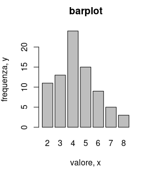
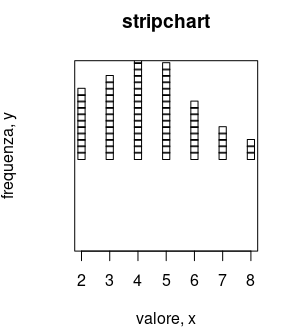
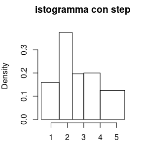
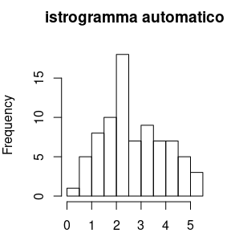
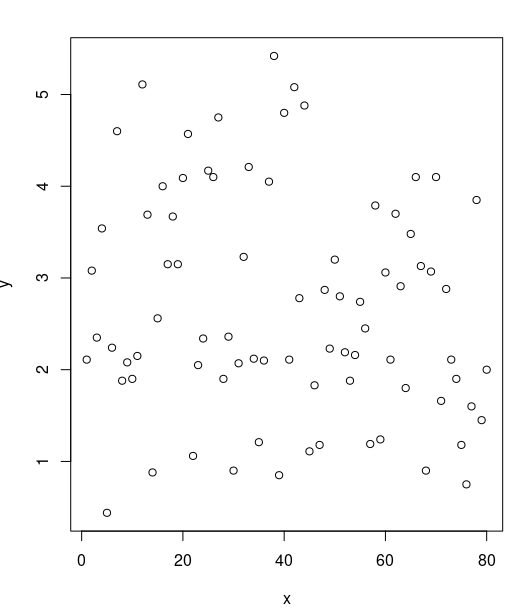
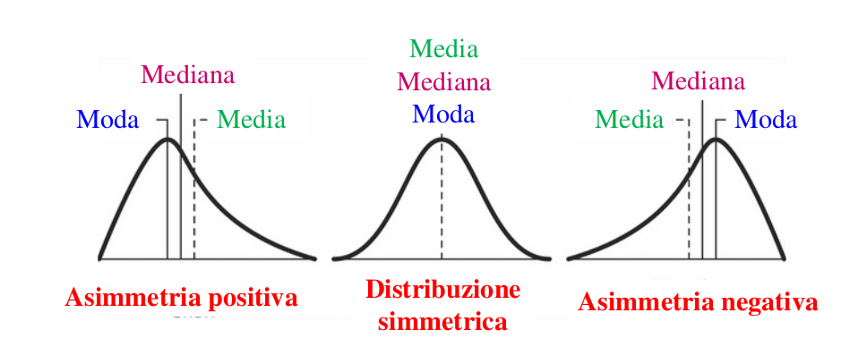
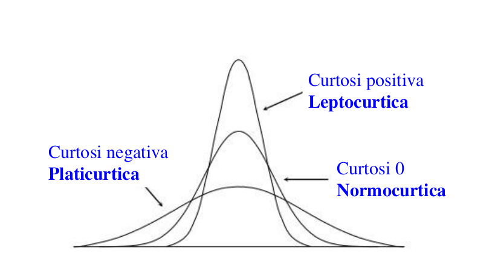
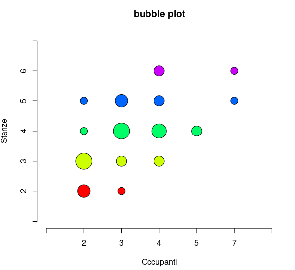
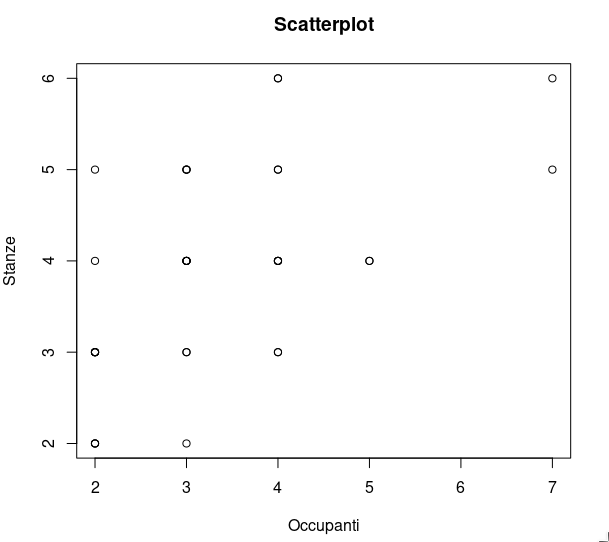
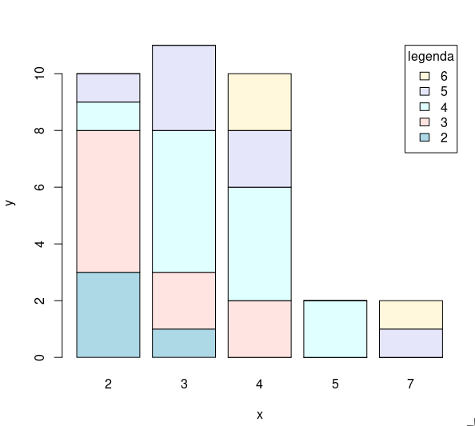

# R CheatSheet

```R
# caricare un file con gui
f <- file.choose()
x <- scan(f, sep = "separatore dati")

# oppure
x <- scan("path/to/file", sep = "separatore dati", dec = "separatore decimali")

# oppure per leggere csv
x <- read.csv("path/to/file", sep="separatore")

# leggere sorgente R
source("path/to/file.R")

# collegare database al path di R
attach(x)

# scollegare database dal path di R
detach(x)

# installare pacchetto e usare una libreria
install.packages("name")
library("name")

# per stampare il risultato di R
print(x)

# per stampare  una variabile, volendo con descrizione
cat("descrizione", x, "descrizione")

# frequenze assolute, sopra valori e sotto frequenze
# x può anche essere una sola colonna del database
table(x)

# frequenze relative
prop.table(table(x))

# frequenze cumulate assolute
cumsum(table(x))

# frequenze cumulate relative
cumsum(prop.table(table(x))

# istogramma con frequenze assolute, su x i dati e su y le frequenze 
barplot(table(x), xlab="etichetta x", ylab="etichetta ", main="titolo")
```
<p align="center">
  
</p>

```R
# grafico a stack con frequenze assolute, su x i dati e su y le frequenze 
stripchart(x, method = "stack", xlab = "etichetta x", ylab = "etichetta ", main="titolo")
```
<p align="center">
  
</p>

```R
# minimo e massimo
min(x)
max(x)

# lista di dati
array <- c(0.4, 1.5, 2.3, 3, 4, 5.5)

# istrogramma con step dato da un array
hist(x, breaks = array, xlab = "etichetta x", ylab = "etichetta ", main = "titolo")
```
<p align="center">
  
</p>

```R
# istrogramma con intervalli automatici

hist(x, xlab = "etichetta x", ylab = "etichetta ", main = "titolo")
```
<p align="center">
  
</p>

```R
# scatterplot
plot(x, xlab = "x", ylab = "y", main = "titolo")
```
<p align="center">
  
</p>

```R
# ordinamento crescente
sort(x)

# ordinamento decrescente (decreasing = dec = true = T)
sort(x, dec = T)

# media
media <- mean(x)
print(media)
# mediana
median(x)

# moda
m <- table(x)
m[m == max(m)]

# varianza campionaria
var(x)

# deviazione standard
sd(x)
sqrt(var(x))

# quantili
quantile(x,c(0.25,0.5,0.75))

# range interquantile
IQR(x)

# range (min, max)
range(x)

# libreria indici di forma
install.packages("e1071")
library("e1071")

# asimmetria
skewness(x)
2 * sqrt(6 / length(x))

# curtosi
kurtosis(x)
4 * sqrt(6 / length(x))
```

<p align="center">
  
</p>

<p align="center">
  
</p>

### Caratteri Bidimensionali

```R
# frequenze assolute
tc <- table(x)

# tabella di contingenza con distribuzioni assolute marginali
tcc <- cbind(tc, margin.table(tc,1)) # marginale stanze
rbind(tcc, margin.table(tcc,2)) # marginale occupanti

# frequenze relative
tcr <- prop.table(table(x))

# tabella di contingenza con distribuzioni relative marginali
tccr <- cbind(tcr,margin.table(tcr,1)) # marginale stanze
rbind(tccr,margin.table(tccr,2)) # marginale occupanti

# bubbleplot (install.packages("labstatR")) prende in automatico le etichette
require("labstatR")
bubbleplot(tc)
```

<p align="center">
  
</p>

```R
# scatterplot
plot(x$valoriX, x$valoriY, xlab="x", ylab="y", main="Titolo")
```
<p align="center">
  
</p>

```R
# barplot con legenda (dotata di posizione e titolo), colori col dati da un array di colori
barplot(table(x),legend=TRUE,col = c("lightblue", "mistyrose", "lightcyan","lavender","cornsilk"),xlab="x",ylab="y",args.legend=list(x="topright",title="legenda"))
```
<p align="center">
  
</p>

<!--- arrivato a slide 22 -->