# R CheatSheet

## Statistica Descrittiva

### Introduzione

```r
# caricare un file con gui
f <- file.choose()
x <- scan(f, sep = "separatore dati")

# oppure
x <- scan("path/to/file", sep = "separatore dati", dec = "separatore decimali")

# oppure per leggere csv
x <- read.csv("path/to/file", sep="separatore", header=TRUE)

# leggere sorgente R
source("path/to/file.R")

# collegare database al path di R
attach(x)

# scollegare database dal path di R
detach(x)

# installare pacchetto e usare una libreria
install.packages("name")
library("name")

# per stampare il risultato di R
print(x)

# per stampare  una variabile, volendo con descrizione
cat("descrizione", x, "descrizione")

# frequenze assolute, sopra valori e sotto frequenze
# x può anche essere una sola colonna del database
table(x)

# frequenze relative
prop.table(table(x))

# frequenze cumulate assolute
cumsum(table(x))

# frequenze cumulate relative
cumsum(prop.table(table(x))

# istogramma con frequenze assolute, su x i dati e su y le frequenze 
barplot(table(x), xlab="etichetta x", ylab="etichetta ", main="titolo")
```

<p align="center">
  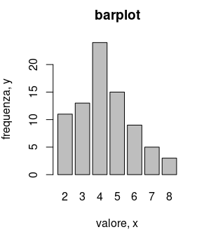
</p>

```r
# grafico a stack con frequenze assolute, su x i dati e su y le frequenze 
stripchart(x, method = "stack", xlab = "etichetta x", ylab = "etichetta ", main="titolo")
```

<p align="center">
  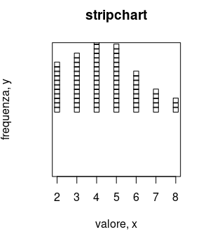
</p>

```r
# minimo e massimo
min(x)
max(x)

# lista di dati
array <- c(0.4, 1.5, 2.3, 3, 4, 5.5)

# istrogramma con step dato da un array
hist(x, breaks = array, xlab = "etichetta x", ylab = "etichetta ", main = "titolo")
```

<p align="center">
  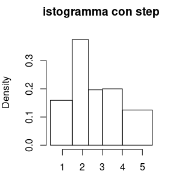
</p>

```r
# istrogramma con intervalli automatici

hist(x, xlab = "etichetta x", ylab = "etichetta ", main = "titolo")
```

<p align="center">
  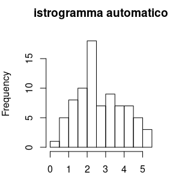
</p>

```r
# scatterplot
plot(x, xlab = "x", ylab = "y", main = "titolo")
```

<p align="center">
  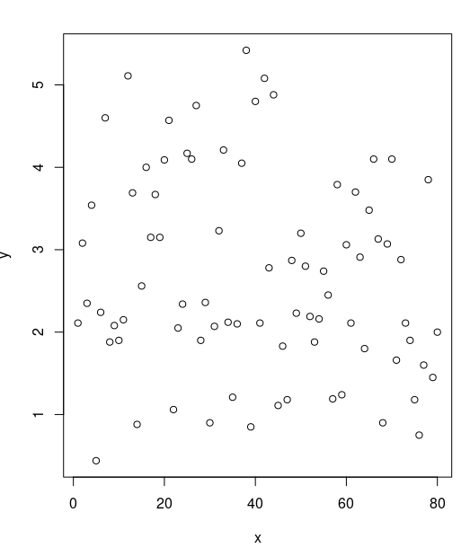
</p>


```r
# ordinamento crescente
sort(x)

# ordinamento decrescente (decreasing = dec = true = T)
sort(x, dec = T)

# media
media <- mean(x)
print(media)
# mediana
median(x)

# moda
m <- table(x)
m[m == max(m)]

# varianza campionaria
var(x)

# deviazione standard
sd(x)
sqrt(var(x))

# quantili
quantile(x,c(0.25,0.5,0.75))

# range interquantile
IQR(x)

# range (min, max)
range(x)

# libreria indici di forma
install.packages("e1071")
library("e1071")

# asimmetria
skewness(x)
2 * sqrt(6 / length(x))

# curtosi
kurtosis(x)
4 * sqrt(6 / length(x))
```

<p align="center">
  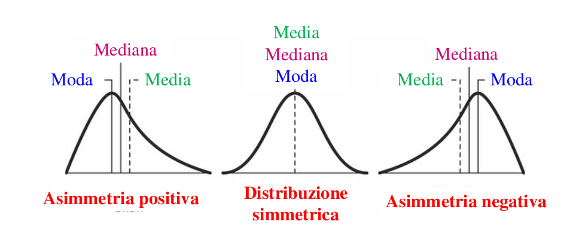
</p>

<p align="center">
  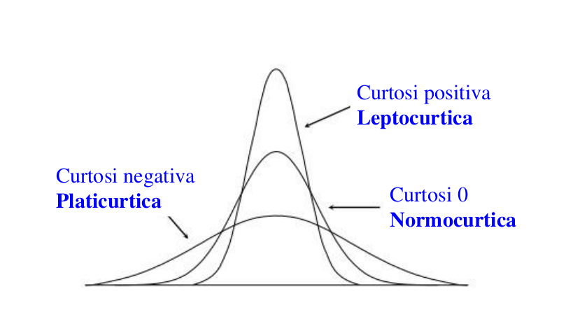
</p>

### Caratteri Bidimensionali

```r
# frequenze assolute
tc <- table(x)

# tabella di contingenza con distribuzioni assolute marginali
tcc <- cbind(tc, margin.table(tc,1)) # marginale stanze
rbind(tcc, margin.table(tcc,2)) # marginale occupanti

# frequenze relative
tcr <- prop.table(table(x))

# tabella di contingenza con distribuzioni relative marginali
tccr <- cbind(tcr,margin.table(tcr,1)) # marginale stanze
rbind(tccr,margin.table(tccr,2)) # marginale occupanti

# bubbleplot (install.packages("labstatR")) prende in automatico le etichette
require("labstatR")
bubbleplot(tc)
```

<p align="center">
  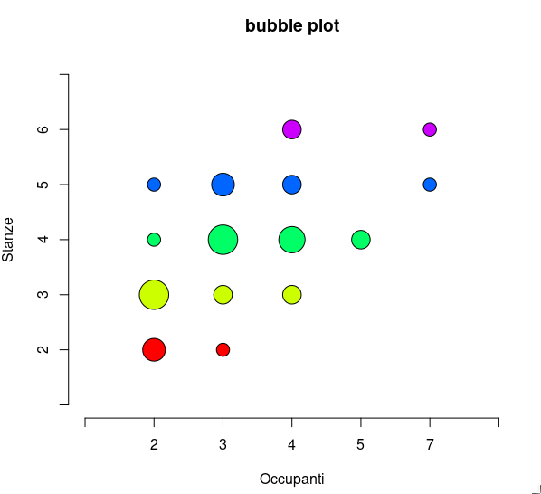
</p>

```r
# scatterplot
plot(x$valoriX, x$valoriY, xlab="x", ylab="y", main="Titolo")
```

<p align="center">
  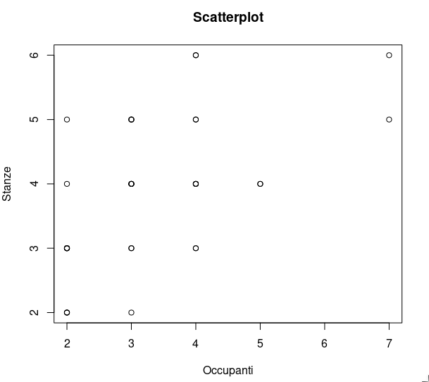
</p>

```r
# barplot con legenda (dotata di posizione e titolo), colori col dati da un array di colori
barplot(table(x),legend=TRUE,col = c("lightblue", "mistyrose", "lightcyan","lavender","cornsilk"),xlab="x",ylab="y",args.legend=list(x="topright",title="legenda"))
```

<p align="center">
  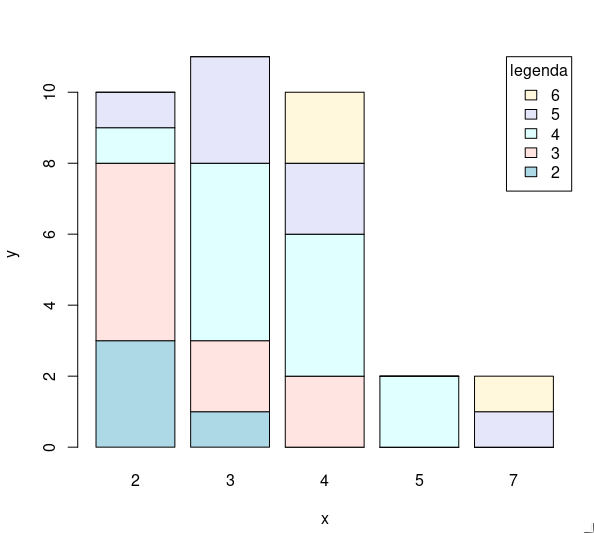
</p>

```r
# covarianza
cov(x$valore1,x$valore2)

# correlazione
cor(x$valore1,x$valore2)
```

### Regressione Lineare

```r
# scarto quadratico medio x
sqrt(mean((x$valore1.x. - mean(x$valore1.x.))^2))

# scarto quadratico medio x
sqrt(mean((x$valore2.y. - mean(x$valore2.y.))^2))

# covarianza
mean((x$valore1.x. - mean(x$valore1.x.)) * 
 (x$valore2.y. -  mean(x$valore2.y.)))


# correlazione
cov(x$valore1.x.,x$valore2.y.) / 
 (sd(x$valore1.x.) * sd(x$valore2.y.))

# retta di regressione (richiamare rr farà stampare i 
# dati  della retta), rr è una classe coi dati della regressione
rr <- lm(x$valore2.y.~ x$valore1.x.)

# per accedere direttamente ai coefficienti
coefficients(rr)

# grafico della regressione 
# prima lo scatterplot (con x$valore acedo ai dati "valore" 
# del dataset x, ma possono essere semplici vettori)
plot(x$valore1.x., x$valore2.y.,xlab="x",ylab="y", main="titolo")

# poi la retta (lwd larghezza linea,
# col = colore, esplicito o in hex)
abline(rr, col="colore", lwd=2)
```

<p align="center">
  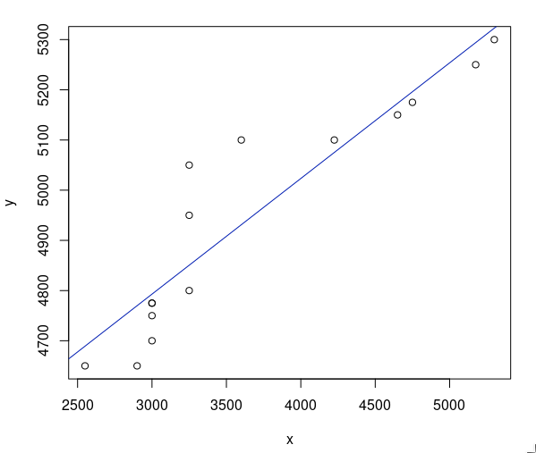
</p>

### Regressione non Lineare

```r
# retta di regressione (richiamare rrnl farà stampare i 
# dati  della retta)
rrnl <- lm(x$valore2.y. ~ 1 + x$valore1.x. + I(x$valore1.x.^2))

# si può usare in alternativa
lm(x$valore2.y. ~ poly(x$valore1.x.,2, raw = TRUE))

# grafico della regressione non lineare
plot(x$valore1.x., x$valore2.y.,xlab="x",ylab="y")
lines(x$valore1.x., predict(rrnl),col="green",lwd=2)
```

<p align="center">
  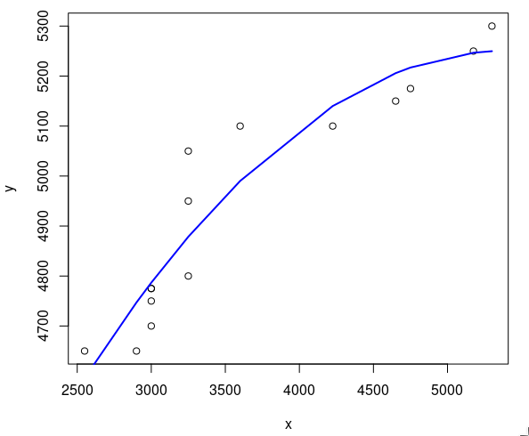
</p>

## Calcolo delle Probabilità

```r
# creazione spazio campione

#carico la libreria
install.packages("prob")
library(prob)

# con una variabile specifica credo una spazio campione
tosscoin
cards
rolldie
urnsamples

# assegno i casi allo spazio campione,per esempio per le 
# facce delle monete
t <- tosscoin(2)

#per un dado a sei facce
r <- rolldie(1)

# spazio campione (primi 6 elementi) di un mazzo composto
# da 52 carte

c <- cards()
head(c)

# spazio campione di un’urna di 3 palline numerate da 1 a 3 
# con estrazione 2 palline, prima il range, poi il numero di 
# estrazioni, poi se possono essere ripetute e infine se 
# possono essere ordinate
u <- urnsamples(1:3, size = 2, replace = TRUE, ordered = TRUE)

# posso accedere a determinati sottoelementi, 
# per esempio il 2 e il 4
u[c(2,4),]

# accedere a sottoinsiemi con funzione subset
# estrarre solo le carte di seme Spade
x<- subset(c, suit == "Spade")

# %in%
# estrarre solo le carte 5 e 6
subset(c, rank %in% 5:6)
# oppure
subset(c,rank==6 | rank==5)

# isin() ritorna TRUE se gli elementi di y sono tutti in x, 
# con ordered = TRUE anche tnendo conto dell'ordine
isin(x, y, ordered = FALSE)

# sottoinsiemi con espressioni matematiche
# somma delle facce dei 3 dadi maggiore di 14
subset(rolldie(3), X1+X2+X3>14)
# somma delle due facce sia numero pari (%% è il modulo)
subset(rolldie(2), ((X1+X2)%%2)==0)
# faccia del primo dado maggiore di quella del secondo
subset(rolldie(2), (X1>X2))
```

### insiemistica

```r
# Unione di due subset A, B
union(A,B)
# Intersezione tra A, B
intersect(A,B)
# Differenza tra A, B
setdiff(A,B)

# isrep(oggetto, valore, ripetizione)
# verifica se in un vettore N compare n volte il valore 
# funziona con numeri e stringhe
isrep(N,vals=valore,nrep=n)
```

### spazio di probabilità

```r
# Spazio di probabilità, l'opzione monospace la hanno
# tosscoin, cards e rolldie
tosscoin(2 ,makespace=TRUE)

# Spazio di probabilità
# probspace(spazio campione, probabilità)
# analogo a rolldie(1,makespace=TRUE)
outcome=rolldie(1)
p=rep(1/6, times=6)
probspace(outcome, probs=p)

# moneta sbilancata
probspace(tosscoin(1), probs=c(0.3,0.7))

# oppure
iidspace(c("H","T"), ntrials = 1, probs = c(0.3,0.7))

# Calcolare la probabilità di un evento
# Prob(spazio di probabilità, evento)
S <-cards(makespace=TRUE)
A <-subset(S, suit==“Heart”)
Prob(A)

# più semplicemente
Prob(S, suit==“Heart”)
```

### permutazioni

```r
# fattoriale di n
factorial(n)

# ripetetizioni in sequenza di x n volte
rep(x, n)

# Combinazioni semplici
# choose(n,k)
# numero di combinazioni di x elementi presi a gruppi di y
choose(x, y)
```

forse manca una parte 


## Distribuzioni Notevoli Discrete

inclusi nel package stats abbiamo le più importanti distribuzioni discrete:

<p align="center">
  
</p>

### Distribuzione binomiale

per la binomiale si ha:
 
```r
dbinom(x, y, prob = z)
```
vediamo un esempio: 

```r
# Quattro monete bilanciate vengono lanciate. 
# Assumendo l’indipendenza dei risultati,
# qual è la probabilità di ottenere due testa e due croce?

dbinom(2,4,prob=1/2)

# Disegnare la distribuzione di probabilità della 
# variabile binomiale: X = “numero
# di volte in cui compare testa”, lanciando 4 volte 
# una moneta bilanciata
plot(c(0:4),dbinom(0:4,4,prob=1/2),type="h",xlab="X")
lines(c(0:4),dbinom(0:4,4,prob=0.5) ,lty=5,col="red")
text(c(0:4), dbinom(0:4,4,prob=0.5),dbinom(0:4,4,prob=0.5))
```
<p align="center">
  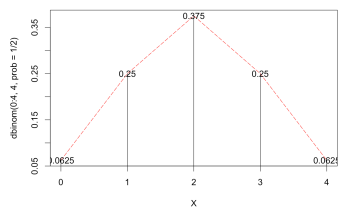
</p>


```r
# impostare il grafico
plot(0, xlim = c(-0.2, 4.2), ylim = c(-0.04, 1.04), type = "n", xlab = "X", ylab =
"Probabilità cumulata")

# disegnare due linee orizzontali che limitano la y
abline(h = c(0,1), lty = 2, col = "grey")

# disegnare una funzione a gradini
lines(stepfun(0:4, pbinom(-1:4, size = 4, prob = 0.5)), verticals = FALSE, do.p
= FALSE)

# disegnare i punti estremi
points(0:4, pbinom(0:4, size = 4, prob = 0.5), pch = 16, cex = 1.2)
points(0:4, pbinom(-1:3, size = 4, prob = 0.5), pch = 1, cex = 1.2)
```

<p align="center">
  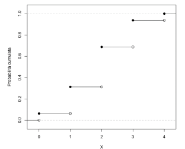
</p>

### Distribuzione di Poisson

Per Poisson si ha:

```r
ppois(x, lambda = y, options)
```

se ho un problema che richiede "almeno" qualcosa uso 
l'opzione _lower.t = FALSE_, se richiede "al più" no
uso nessuna opzione, di default si ha _lower.t = TRUE_

Vediamo ora un esempio per tracciare un grafico con Poisson,
con lambda = 1:

```r
plot(c(0:5),dpois(0:5,1),type="h",xlab="X")
text(c(0:5), dpois(0:5,1), round(dpois(0:5,1),4))
```
<p align="center">
  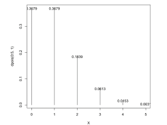
</p>

### Distribuzione Geometrica

Per la geometrica si ha:

```r
dgeom(x, prob = y, options)
```
## Distribuzioni notevoli Continue

Sono sempre incluse in stats:
<p align="center">
  
</p>