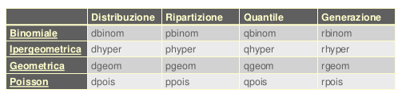

# R CheatSheet

## Statistica Descrittiva

### Introduzione

```r
# caricare un file con gui
f <- file.choose()
x <- scan(f, sep = "separatore dati")

# oppure
x <- scan("path/to/file", sep = "separatore dati", dec = "separatore decimali")

# oppure per leggere csv
x <- read.csv("path/to/file", sep="separatore", header=TRUE)

# leggere sorgente R
source("path/to/file.R")

# collegare database al path di R
attach(x)

# scollegare database dal path di R
detach(x)

# installare pacchetto e usare una libreria
install.packages("name")
library("name")

# per stampare il risultato di R
print(x)

# per stampare  una variabile, volendo con descrizione
cat("descrizione", x, "descrizione")

# frequenze assolute, sopra valori e sotto frequenze
# x può anche essere una sola colonna del database
table(x)

# frequenze relative
prop.table(table(x))

# frequenze cumulate assolute
cumsum(table(x))

# frequenze cumulate relative
cumsum(prop.table(table(x))

# istogramma con frequenze assolute, su x i dati e su y le frequenze 
barplot(table(x), xlab="etichetta x", ylab="etichetta ", main="titolo")
```

<p align="center">
  
</p>

```r
# grafico a stack con frequenze assolute, su x i dati e su y le frequenze 
stripchart(x, method = "stack", xlab = "etichetta x", ylab = "etichetta ", main="titolo")
```

<p align="center">
  
</p>

```r
# minimo e massimo
min(x)
max(x)

# lista di dati
array <- c(0.4, 1.5, 2.3, 3, 4, 5.5)

# istrogramma con step dato da un array
hist(x, breaks = array, xlab = "etichetta x", ylab = "etichetta ", main = "titolo")
```

<p align="center">
  
</p>

```r
# istrogramma con intervalli automatici

hist(x, xlab = "etichetta x", ylab = "etichetta ", main = "titolo")
```

<p align="center">
  
</p>

```r
# scatterplot
plot(x, xlab = "x", ylab = "y", main = "titolo")
```

<p align="center">
  
</p>


```r
# ordinamento crescente
sort(x)

# ordinamento decrescente (decreasing = dec = true = T)
sort(x, dec = T)

# media
media <- mean(x)
print(media)
# mediana
median(x)

# moda
m <- table(x)
m[m == max(m)]

# varianza campionaria
var(x)

# deviazione standard
sd(x)
sqrt(var(x))

# quantili
quantile(x,c(0.25,0.5,0.75))

# range interquantile
IQR(x)

# range (min, max)
range(x)

# libreria indici di forma
install.packages("e1071")
library("e1071")

# asimmetria
skewness(x)
2 * sqrt(6 / length(x))

# curtosi
kurtosis(x)
4 * sqrt(6 / length(x))
```

<p align="center">
  
</p>

<p align="center">
  
</p>

### Caratteri Bidimensionali

```r
# frequenze assolute
tc <- table(x)

# tabella di contingenza con distribuzioni assolute marginali
tcc <- cbind(tc, margin.table(tc,1)) # marginale stanze
rbind(tcc, margin.table(tcc,2)) # marginale occupanti

# frequenze relative
tcr <- prop.table(table(x))

# tabella di contingenza con distribuzioni relative marginali
tccr <- cbind(tcr,margin.table(tcr,1)) # marginale stanze
rbind(tccr,margin.table(tccr,2)) # marginale occupanti

# bubbleplot (install.packages("labstatR")) prende in automatico le etichette
require("labstatR")
bubbleplot(tc)
```

<p align="center">
  
</p>

```r
# scatterplot
plot(x$valoriX, x$valoriY, xlab="x", ylab="y", main="Titolo")
```

<p align="center">
  
</p>

```r
# barplot con legenda (dotata di posizione e titolo), colori col dati da un array di colori
barplot(table(x),legend=TRUE,col = c("lightblue", "mistyrose", "lightcyan","lavender","cornsilk"),xlab="x",ylab="y",args.legend=list(x="topright",title="legenda"))
```

<p align="center">
  
</p>

```r
# covarianza
cov(x$valore1,x$valore2)

# correlazione
cor(x$valore1,x$valore2)
```

### Regressione Lineare

```r
# scarto quadratico medio x
sqrt(mean((x$valore1.x. - mean(x$valore1.x.))^2))

# scarto quadratico medio x
sqrt(mean((x$valore2.y. - mean(x$valore2.y.))^2))

# covarianza
mean((x$valore1.x. - mean(x$valore1.x.)) * 
 (x$valore2.y. -  mean(x$valore2.y.)))


# correlazione
cov(x$valore1.x.,x$valore2.y.) / 
 (sd(x$valore1.x.) * sd(x$valore2.y.))

# retta di regressione (richiamare rr farà stampare i 
# dati  della retta), rr è una classe coi dati della regressione
rr <- lm(x$valore2.y.~ x$valore1.x.)

# per accedere direttamente ai coefficienti
coefficients(rr)

# grafico della regressione 
# prima lo scatterplot (con x$valore acedo ai dati "valore" 
# del dataset x, ma possono essere semplici vettori)
plot(x$valore1.x., x$valore2.y.,xlab="x",ylab="y", main="titolo")

# poi la retta (lwd larghezza linea,
# col = colore, esplicito o in hex)
abline(rr, col="colore", lwd=2)
```

<p align="center">
  
</p>

### Regressione non Lineare

```r
# retta di regressione (richiamare rrnl farà stampare i 
# dati  della retta)
rrnl <- lm(x$valore2.y. ~ 1 + x$valore1.x. + I(x$valore1.x.^2))

# si può usare in alternativa
lm(x$valore2.y. ~ poly(x$valore1.x.,2, raw = TRUE))

# grafico della regressione non lineare
plot(x$valore1.x., x$valore2.y.,xlab="x",ylab="y")
lines(x$valore1.x., predict(rrnl),col="green",lwd=2)
```

<p align="center">
  
</p>

## Calcolo delle Probabilità

```r
# creazione spazio campione

#carico la libreria
install.packages("prob")
library(prob)

# con una variabile specifica credo una spazio campione
tosscoin
cards
rolldie
urnsamples

# assegno i casi allo spazio campione,per esempio per le 
# facce delle monete
t <- tosscoin(2)

#per un dado a sei facce
r <- rolldie(1)

# spazio campione (primi 6 elementi) di un mazzo composto
# da 52 carte

c <- cards()
head(c)

# spazio campione di un’urna di 3 palline numerate da 1 a 3 
# con estrazione 2 palline, prima il range, poi il numero di 
# estrazioni, poi se possono essere ripetute e infine se 
# possono essere ordinate
u <- urnsamples(1:3, size = 2, replace = TRUE, ordered = TRUE)

# posso accedere a determinati sottoelementi, 
# per esempio il 2 e il 4
u[c(2,4),]

# accedere a sottoinsiemi con funzione subset
# estrarre solo le carte di seme Spade
x<- subset(c, suit == "Spade")

# %in%
# estrarre solo le carte 5 e 6
subset(c, rank %in% 5:6)
# oppure
subset(c,rank==6 | rank==5)

# isin() ritorna TRUE se gli elementi di y sono tutti in x, 
# con ordered = TRUE anche tnendo conto dell'ordine
isin(x, y, ordered = FALSE)

# sottoinsiemi con espressioni matematiche
# somma delle facce dei 3 dadi maggiore di 14
subset(rolldie(3), X1+X2+X3>14)
# somma delle due facce sia numero pari (%% è il modulo)
subset(rolldie(2), ((X1+X2)%%2)==0)
# faccia del primo dado maggiore di quella del secondo
subset(rolldie(2), (X1>X2))
```

### insiemistica

```r
# Unione di due subset A, B
union(A,B)
# Intersezione tra A, B
intersect(A,B)
# Differenza tra A, B
setdiff(A,B)

# isrep(oggetto, valore, ripetizione)
# verifica se in un vettore N compare n volte il valore 
# funziona con numeri e stringhe
isrep(N,vals=valore,nrep=n)
```

### spazio di probabilità

```r
# Spazio di probabilità, l'opzione monospace la hanno
# tosscoin, cards e rolldie
tosscoin(2 ,makespace=TRUE)

# Spazio di probabilità
# probspace(spazio campione, probabilità)
# analogo a rolldie(1,makespace=TRUE)
outcome=rolldie(1)
p=rep(1/6, times=6)
probspace(outcome, probs=p)

# moneta sbilancata
probspace(tosscoin(1), probs=c(0.3,0.7))

# oppure
iidspace(c("H","T"), ntrials = 1, probs = c(0.3,0.7))

# Calcolare la probabilità di un evento
# Prob(spazio di probabilità, evento)
S <-cards(makespace=TRUE)
A <-subset(S, suit==“Heart”)
Prob(A)

# più semplicemente
Prob(S, suit==“Heart”)
```

### permutazioni

```r
# fattoriale di n
factorial(n)

# ripetetizioni in sequenza di x n volte
rep(x, n)

# Combinazioni semplici
# choose(n,k)
# numero di combinazioni di x elementi presi a gruppi di y
choose(x, y)
```

forse manca una parte 


## Distribuzioni Notevoli Discrete

inclusi nel package stats abbiamo le più importanti distribuzioni discrete:

<p align="center">
  
</p>

### Distribuzione binomiale

per la binomiale si ha:
 
```r
dbinom(x, y, prob = z)
```
vediamo un esempio: 

```r
# Quattro monete bilanciate vengono lanciate. 
# Assumendo l’indipendenza dei risultati,
# qual è la probabilità di ottenere due testa e due croce?

dbinom(2,4,prob=1/2)

# Disegnare la distribuzione di probabilità della 
# variabile binomiale: X = “numero
# di volte in cui compare testa”, lanciando 4 volte 
# una moneta bilanciata
plot(c(0:4),dbinom(0:4,4,prob=1/2),type="h",xlab="X")
lines(c(0:4),dbinom(0:4,4,prob=0.5) ,lty=5,col="red")
text(c(0:4), dbinom(0:4,4,prob=0.5),dbinom(0:4,4,prob=0.5))
```
<p align="center">
  
</p>


```r
# impostare il grafico
plot(0, xlim = c(-0.2, 4.2), ylim = c(-0.04, 1.04), type = "n", xlab = "X", ylab =
"Probabilità cumulata")

# disegnare due linee orizzontali che limitano la y
abline(h = c(0,1), lty = 2, col = "grey")

# disegnare una funzione a gradini
lines(stepfun(0:4, pbinom(-1:4, size = 4, prob = 0.5)), verticals = FALSE, do.p
= FALSE)

# disegnare i punti estremi
points(0:4, pbinom(0:4, size = 4, prob = 0.5), pch = 16, cex = 1.2)
points(0:4, pbinom(-1:3, size = 4, prob = 0.5), pch = 1, cex = 1.2)
```

<p align="center">
  
</p>

### Distribuzione di Poisson

Per Poisson si ha:

```r
ppois(x, lambda = y, options)
```

se ho un problema che richiede "almeno" qualcosa uso 
l'opzione _lower.t = FALSE_, se richiede "al più" no
uso nessuna opzione, di default si ha _lower.t = TRUE_

Vediamo ora un esempio per tracciare un grafico con Poisson,
con lambda = 1:

```r
plot(c(0:5),dpois(0:5,1),type="h",xlab="X")
text(c(0:5), dpois(0:5,1), round(dpois(0:5,1),4))
```
<p align="center">
  
</p>

### Distribuzione Geometrica

Per la geometrica si ha:

```r
dgeom(x, prob = y, options)
```
## Distribuzioni notevoli Continue

Sono sempre incluse in stats:
<p align="center">
  
</p>

inoltre il package distr contiene classi per molte altre distribuzioni:

<p align="center">
  
</p>

### Distribuzione uniforme

```r
punif(x, min, max, options)
```
vediamo il grafico:

```r
library(distr)
X <- Unif(Min = 0, Max = 30)
plot(X, to.draw.arg=c("d","p"))
```

<p align="center">
  
</p>

per generare n numeri in una distribuzione uniforme tra min e max:

```r
runif(n, min, max)
```

### Distribuzione Esponenziale

```r
pexp(m, lambda, options)
```

per disegnare scarico il package distr e ne carico la libreria
poi:

```r
plot(Exp(rate = 0.2), to.draw.arg = c("d","p"))
```

<p align="center">
  
</p>

### Distribuzione Normale

Per la normale si ha:

<p align="center">
  
</p>

Cerco la normale in [a,b] con media = m e deviazione standard = s:

```r
pnorm(b, mean = m, sd = s) - pnorm(a, mean = m, sd = s)
```

passiamo al disegno, sempre usando distr, con m = 100 e s = 15:

```r
X <- Norm(mean = 100, sd = 15)
> plot(X, to.draw.arg=c("d","p"))
```
<p align="center">
  
</p>

generiamo n numeri in una normale standardizzata:

```r
rand <- rnorm(n)

# che possono essere messi in un istogramma

hist(rand)
```
<p align="center">
  
</p>

per i quantili uso (se chiede 1% x sarà 0.99):

```r
qnorm(x, mean = m, sd = s)
```

## Chi-Quadro, t di Student e F di fisher

<p align="center">
  
</p>

funzionano con x indicante l'area di cui si vuole calcolare
(se chiede di trovare t tale per cui l'area a destra è 0.05 x sarà 0.95 etc...) 
e con df = g gradi di liberà:

```r
qt(x, df = g)
```
## STIME DI PARAMETRI

Si usa:
```r
library(TeachingDemos)
```

### STIME INTERVALLARI

Vediamo innanzitutto le stime intervallari, conm gli intervalli di confidenza per la media:

- ***popolazione non normalmente distribuita e varianza sconosciuta:***
  nell'esempio con livello di confidenza al 95% e un plot di dati x:
  ```r
  z.test(x, mu = 0, stdev, alternative = c("two.sided", "less", "greater"), sd =
  stdev, n=length(x), conf.level = 0.95, ...))
  ```
- ***popolazione normalmente distribuita e varianza sconosciuta:***
  nell'esempio con livello di confidenza al 95%
  ```r
  t.test(x, y = NULL, alternative = c("two.sided", "less", "greater"), mu = 0,
  paired = FALSE, var.equal = FALSE, conf.level = 0.95, ...)
  ```
- ***popolazione non normalmente distribuita e varianza nota:***
  nell'esempio con 100 valori, valore medio 82 e varianza 25, e livello di confidenza al 97%
  ```r
  out <- z.test(82,stdev=sqrt(25),alternative="two.sided",n=100,conf.level=0.97)
  > out$conf.int
  [1] 80.91495 83.08505
  attr(,"conf.level")
  [1] 0.97
  ```
  
- ***popolazione normalmente distribuita e varianza nota:***
  da un plot di dati *fr*, ovvero un array, con una deviazione standard pari a 30 e un livbello di confidenza del 95% ho.
  ```r
  out <- z.test(fr, stdev=30, alternative="two.sided",conf.level = 0.95)
  > out
  One Sample z-test
  data: fr
  z = 78.785, n = 15.000, Std. Dev. = 30.000, Std. Dev. of the sample mean = 7.746, p-value <
  2.2e-16
  alternative hypothesis: true mean is not equal to 0
  95 percent confidence interval:
  595.0849 625.4485
  sample estimates:
  mean of fr
  610.2667
  > out$conf.int
  [1] 595.0849 625.4485
  attr(,"conf.level")
  [1] 0.95)
  out$conf.int
  [1] 595.0849 625.4485
  attr(,"conf.level")
  [1] 0.95)
  ```
in ogni caso il z.test deve essere caricato in una variabile, per esempio *out*
da cui ottenere l'intervasllo con:
```r
out$conf.int
```

### STIME INTERVALLARI PER LA VARIANZA
Si ha una popolazione normalmente distribuita e si usa, per esempio per un livello di confidenza del 95%, con sigma pari a 1 e plot di dati *x*:

```r
sigma.test(x, sigma = 1, sigmasq = sigma^2, alternative = c("two.sided",
"less", "greater"), conf.level = 0.95, ...)
```
e come prima il sigma.test deve essere caricato in una variabile, per esempio *out*
da cui ottenere l'intervallo con:
```r
out$conf.int
```
per la sigma si ricorda l'uso di *qnorm* per avere il test del Chi-Quadro, per esempio *qnorm(1-alpha/2)*

nello studio delle stime intervallari può essere comoda la funzione *ceiling* che resitutisce l'intero per difetto dell'argomento.

##  VERIFICA DI IPOTESI: TEST PARAMETRICI

L'unico test di verifica che prevede l'introduzione di qualcosa di nuovo è il
***test di incorrelazione***:
```r
cor.test(x, y, alternative = c("two.sided", "less", "greater"), method =
c("pearson", "kendall", "spearman"), exact = NULL, conf.level =
0.95, continuity = FALSE, ...)
```
che permette di scegliere il metodo, i dati sulla *x* e sulla *y* e il livello di confidenza.

Per il resto si tratta solo di applicare quanto spiegato fino ad ora, si rimanda alle slide per gli esempi

## VERIFICA DI IPOTESI: TEST NON PARAMETRICI

Si introduce il test di ***Kolmogorov-Smirnov***, *x* e *y* plot di dati:
```r
ks.test(x, y, ...,alternative = c("two.sided", "less", "greater"), exact = NULL)
```
con *...* indicanti i parametri della distribuzione, per esempio *punif* (uniforme) con in aggiunta gli estremi della distribuzione, *pexp* (esponenziale) con il valore della lambda, e exact se si ha un p-value specifico.

Si ha poi il test del ***Chi-Quadro***:
```r
chisq.test(x, y = NULL, correct = TRUE, p = rep(1/length(x), length(x)),
rescale.p = FALSE, simulate.p.value = FALSE, B = 2000)
```
con correct che applica la correzione continua per tabelle 2x2, *p* vettore di probabilità
di cardinalità pari a quella di *x* (si sfrutta qui rep che replica una cosa un tot di volte), 
rescale.p che se true normalizza le probabilità di *p* per avere somma 1,
simulate.p.value per indicare se si deve usare il metodo MonteCarlo per compuare il p-value e B che indica il numero di interazioni di MOnteCarlo.

Si ha poi il ***test dei ranghi di Wilcoxon***:
```r
wilcox.test(x, y = NULL, alternative = c("two.sided", "less", "greater"), mu = 0,
paired = FALSE, exact = NULL, correct = TRUE, conf.int = FALSE, conf.level =
0.95, ...)
```
*mu* rappresenta il parametro opzionale per per l'ipotesi nulla, *paired* indica se si vuole il test dedicato, 
*exact* se si vuole computareil p-value, *conf.int* se si vuole l'intervallo di condidenza
e *conf.level* oer indicare il livello di confidenza.

In tutti i casi sopra la *y* può essere omessa, nel caso bisimensionale, se *x* è una matrice.

Per il ***coefficiente di correlazione dei ranghi di Spearman***:
```r
cor(x, y = NULL, use = "everything", method="spearman")
```

## REGRESSIONE LINEARE

Per una regressione lineare semplice, con stima dei parametri di modello, si ha:
```r
lm(formula, data, subset, weights, na.action, method = "qr", model = TRUE, x
= FALSE, y = FALSE, qr = TRUE, singular.ok = TRUE, contrasts = NULL,
offset, ...)
```
vediamo un banale esempio:
```r
X <- c(-3, 4, 5, 8, 6)
Y <- c(2, 6, 7, 10, 5)
Rxy <- cor(X,Y,method="p")
Rxy

rr <- lm(Y ~ X)
rr
Call:
lm(formula = Y ~ X)
Coefficients:
(Intercept) X
3.5429    0.6143

# coefficienti
coeff <- rr$coefficients
# creare grafico
plot(Y ~ X)
abline(coef(rr),col='red', lwd = 3)
```
e per la stima puntuale della variabile, per esempio per *Y* se il regressore *X* vale 5:
```r
new <- data.frame(X=5)
predict(rr,new)
1
6.614286
#stima puntuale della variabile risposta
predict(rr)
1        2        3        4        5
1.700000 6.000000 6.614286 8.457143 7.228571
```
per i residui di un modello:
```r
residuals(rr)
1            2            3            4             5
3.000000e-01 6.522560e-16 3.857143e-01 1.542857e+00 -2.228571e+00
```
e per ntervalli di confidenza per i coefficienti di regressione, per esempio al 95%:
```r
confint(rr, level=0.95) # livello di fiducia 0.05
            5 %         95 %
(Intercept) 1.0930143   5.992700
X           0.1670077   1.061564
```
per intervalli di confidenza per valori stimati della variabile risposta e intervalli di predizione:
```r
predict(object, newdata, se.fit = FALSE, scale = NULL, df = Inf, interval =
c("none", "confidence", "prediction"), level = 0.95, type = c("response", "terms"),
terms = NULL, na.action = na.pass, pred.var = res.var/weights, weights = 1, ...)

# nel dettaglio

# intervalli di confidenza
predict(object,newdata,...interval=“confidence”,level = 0.95...)

# intervalli di predizione
predict(object,newdata,...interval=“prediction”,level = 0.95...)

rappresentazione grafica degli intervalli di confidenza e degli intervalli di predizione
> library(HH)
> ci.plot(rr,conf.level=0.95)
```

<p align="center">
  
</p>

passiamo allo studio dell'attendibilità del modello usando *summary* usando una variabile (nell'esempio *fm*) su cui sono stati caricati i risultati di *lm*:
```r
summary(fm)

Call:
lm(formula = Y ~ X)

Residuals:
       1        2        3        4        5 
-0.04082  0.75510 -1.09184  0.11224  0.26531 

Coefficients:
            Estimate Std. Error t value Pr(>|t|)    
(Intercept)   6.6531     1.3559   4.907 0.016207 *  
X             1.9490     0.1023  19.047 0.000316 ***
---
Signif. codes:  0 ‘***’ 0.001 ‘**’ 0.01 ‘*’ 0.05 ‘.’ 0.1 ‘ ’ 1

Residual standard error: 0.7846 on 3 degrees of freedom
Multiple R-squared:  0.9918,	Adjusted R-squared:  0.9891 
F-statistic: 362.8 on 1 and 3 DF,  p-value: 0.000316
```
Vediamo infine i vari test dei residui, caricando i residui in una variabile con *residuals*:
```r
X <- c(-3, 4, 5, 8, 6)
Y <- c(2, 6, 7, 10, 5)
rr <- lm(Y ~ X)
residui <- residuals(rr)
```
Iniziamo col test di normalità di ***Shapiro Wilk***:
```r
shapiro.test(residui)

	Shapiro-Wilk normality test
	data: residui
	W = 0.89097, p-value = 0.362
```
poi si ha il test di incorrelazione di ***Durbin e Watson***:
```r
dwtest(rr, alternative="two.sided")
	Durbin-Watson test
	data: rr
	DW = 2.0831, p-value = 0.6294
	alternative hypothesis: true autocorrelation is not 0
```

quello di ***omoschedasticità*** con metodi grafici:
```r
plot(X,rr$residuals,xlab="X",ylab="RESIDUAL",main="Verifica Omoschedasticità ")
abline(h=0)
```
<p align="center">
  
</p

e la ***distanza di Cock*** con gli *outliers*:
```r
cook <- cooks.distance(rr)
cook
	1            2            3            4            5
	1.601695e+00 2.628942e-32 1.021151e-02 6.177966e-01 4.576271e-01
plot(rr, main="Cook's Distance",which=4)
```
<p align="center">
  
</p

#### REGRESSIONE MULTILINEARE MULTIPLA

Per la regressione multipla si ha:
```r
lm(formula, data, subset, weights, na.action, method = "qr", model = TRUE, x
= FALSE, y = FALSE, qr = TRUE, singular.ok = TRUE, contrasts = NULL,
offset, ...)
```
Vediamo un esempio completo (trees in R è un dataset con cirocnferenza, altezza e volume di 31 alberi di ciliegio):
```r
# coefficienti retta di regressione 

trees.lm <- lm(Volume ~ Girth + Height, data = trees)
trees.lm
	Call:
	lm(formula = Y ~ X)

	Residuals:
1        2        3        4        5 
	-0.04082  0.75510 -1.09184  0.11224  0.26531 

	Coefficients:
Estimate Std. Error t value Pr(>|t|)    
	(Intercept)   6.6531     1.3559   4.907 0.016207 *  
	X             1.9490     0.1023  19.047 0.000316 ***
	---
	Signif. codes:  0 ‘***’ 0.001 ‘**’ 0.01 ‘*’ 0.05 ‘.’ 0.1 ‘ ’ 1

	Residual standard error: 0.7846 on 3 degrees of freedom
	Multiple R-squared:  0.9918,	Adjusted R-squared:  0.9891 
	F-statistic: 362.8 on 1 and 3 DF,  p-value: 0.000316

	> trees.lm <- lm(Volume ~ Girth + Height, data = trees)
	> trees.lm

	Call:
	lm(formula = Volume ~ Girth + Height, data = trees)

	Coefficients:
	(Intercept)        Girth       Height
	-57.9877       4.7082       0.3393

# intervalli di confidenza
confint(trees.lm)
                     2.5 %      97.5 %
	(Intercept) -75.68226247 -40.2930554
	Girth         4.16683899   5.2494820
	Height        0.07264863   0.6058538
	
#attendibilità del modello
summary(trees.lm)
	Call:
	lm(formula = Volume ~ Girth + Height, data = trees)

	Residuals:
		Min      1Q  Median      3Q     Max 
	-6.4065 -2.6493 -0.2876  2.2003  8.4847 

	Coefficients:
    Estimate Std. Error t value Pr(>|t|)    
	(Intercept) -57.9877     8.6382  -6.713 2.75e-07 ***
	Girth         4.7082     0.2643  17.816  < 2e-16 ***
	Height        0.3393     0.1302   2.607   0.0145 *  
	---
	Signif. codes:  0 ‘***’ 0.001 ‘**’ 0.01 ‘*’ 0.05 ‘.’ 0.1 ‘ ’ 1

	Residual standard error: 3.882 on 28 degrees of freedom
	Multiple R-squared:  0.948,	Adjusted R-squared:  0.9442 
	F-statistic:   255 on 2 and 28 DF,  p-value: < 2.2e-16

```
